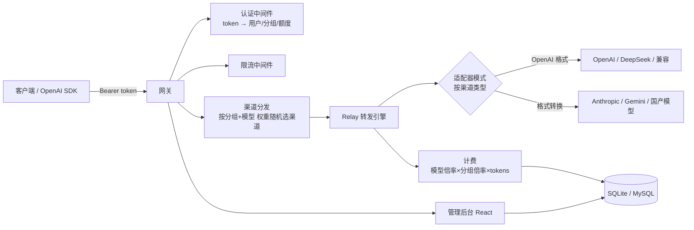

# 01 · One API 系 —— 全家桶型 AI 中转站

> 这一类是"全家桶"路线：自带管理后台、用户体系、数据库、计费、渠道管理，什么都有。
> 代价是重：SQLite/MySQL 数据库 + 前端页面 + 常驻内存几百 MB。
> **RelayHub 明确不要学它们的"重"，但要学它们的"请求链路设计"。**

| 项目 | Star | 语言 | 定位 | 协议 |
|---|---|---|---|---|
| [one-api](./one-api.md) | 36.5k | Go + React | 鼻祖：LLM API 管理 & 分发 | MIT |
| [new-api](./new-api.md) | 45.7k | Go + React | one-api 二开：更现代的网关 + 缓存计费 | AGPL-3.0 |
| [coai (chatnio)](./coai.md) | 9.3k | Go + React + MySQL/Redis | NextWeb + OneAPI 合体，C/B 端通吃 | Apache-2.0 |

## 这一系的共同架构

## 值得偷师的点（RelayHub 只取这几条）

1. **适配器模式**：每个渠道一个 `Adaptor`，统一接口
   （`GetRequestURL / ConvertRequest / DoRequest / DoResponse / GetModelList`），新增渠道不改主流程 —— **插件化的雏形**。
2. **分发中间件**：`group2model2channels` 内存索引 + 按优先级/权重随机选渠道，失败自动换渠道重试（5xx/429）。
3. **模型映射**：`用户请求的模型名 → 渠道真实模型名`，一个渠道可以"伪装"成任何模型。
4. **计费公式**：`额度 = 分组倍率 × 模型倍率 × (提示token + 补全token × 补全倍率)`，流式响应结束时回填真实 usage。

## 不该学的东西

- ❌ 前端管理后台（RelayHub 用 `config.yaml`，不需要 UI）
- ❌ 用户注册/登录/兑换码/支付（自己用，一个 API Key 就够）
- ❌ 数据库（配置文件一把梭）
