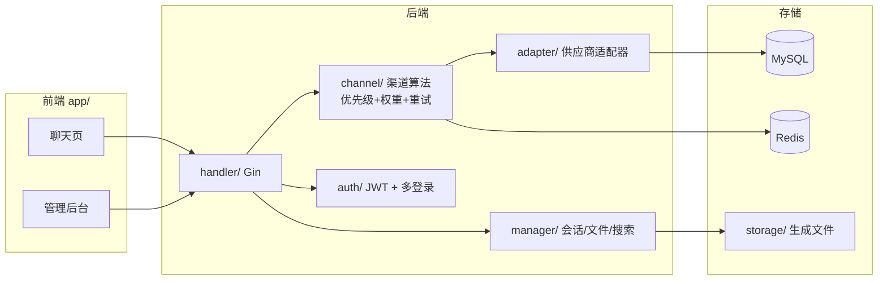
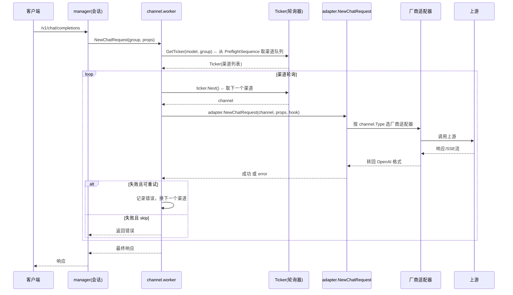
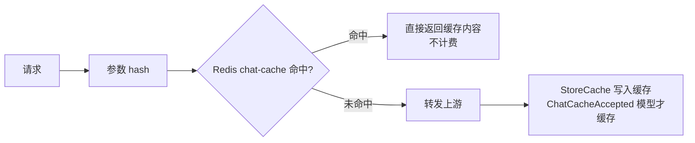

# coai (chatnio)

> **"Next Web + One API" 合体**：既做 C 端聊天站（对话同步/分享/文件解析/联网搜索），又做 B 端 API 分发。
> 前身 chatnio，Apache-2.0，是"全家桶"路线里产品化做的最全的。

## 项目卡片

| 项 | 值 |
|---|---|
| 仓库 | [coaidev/coai](https://github.com/coaidev/coai) |
| Star | ~9.3k |
| 语言 | Go (Gin) + React (Shadcn UI) |
| 技术栈 | Go + Gin + Redis + MySQL + WebSocket + PWA |
| 协议 | Apache-2.0 |
| 官方文档 | [coai.dev](https://coai.dev/) |

## 核心能力（挑与中转相关的）

- 35+ 供应商 / 200+ 模型，OpenAI 兼容 API 分发（`/v1/chat/completions`、`/v1/images`、`/v1/models`、`/v1/billing`）
- 渠道算法：优先级 + 同优先级权重负载均衡 + 失败自动重试 + 用户分组 + 模型重定向 + 上游隐藏
- 双计费：订阅制（Subscription）+ 弹性计费（按次/token/不扣费/匿名调用）
- 模型缓存：相同参数 hash 命中直接返回缓存（命中不计费）
- 上游一键同步：渠道/模型市场/价格从上游站点同步
- 聊天站功能：跨设备对话同步、分享链接、文件解析（PDF/Docx/OCR）、SearXNG 联网搜索

## 架构要点



## 对 RelayHub 的启发

1. **同优先级权重负载均衡** —— one-api 只有"同优先级随机"，coai/new-api 加了权重；RelayHub 的渠道选择算法要做权重。
2. **模型缓存（参数 hash 命中返回）** —— 很实用的省 token 手段，适合做成可选插件（注意和计费插件的联动：命中不扣费）。
3. **"上游同步"概念** —— 类似 new-api 的 channel 同步；RelayHub 单人用可以做成 `relayhub sync` 子命令从上游拉模型列表。
4. 反面教材：C 端聊天站功能（对话同步/分享/搜索/文件解析）和 RelayHub 完全无关，直接跳过。

---

# 逻辑框架（源码级）

> 以下基于本地源码 `coai/`（submodule）逐文件梳理。

## 一、模块清单表

| 模块（源码路径） | 职责 | 关键文件 |
|---|---|---|
| `main.go` | 入口：读配置 → `admin.InitInstance` → `channel.InitManager` → 注册路由 → 启动 | `main.go` |
| `auth/` | 登录认证（账号密码/JWT） | `auth/` |
| `admin/` | 管理后台：实例初始化、系统设置 | `admin/` |
| `channel/` | **渠道管理核心**：`Manager`（渠道序列+模型索引）、`ChargeManager`（计费倍率）、`PlanManager`（订阅套餐）、`SystemConfig`、ticker（轮询调度）、worker（请求分发） | `manager.go`, `worker.go`, `ticker.go`, `charge.go`, `plan.go` |
| `adapter/` | **供应商适配器**：每家一个目录（openai/claude/gemini/qianfan/hunyuan/midjourney 等），统一 `NewChatRequest` 入口 | `adapter.go`, `router.go`, `adapter/<厂商>/` |
| `manager/` | 会话管理（conversation）、WebSocket 消息推送 | `manager/` |
| `addition/` | 附加功能（联网搜索等） | `addition/` |
| `connection/` | 数据库连接（MySQL/Redis） | `connection/` |
| `middleware/` | Gin 中间件 | `middleware/` |
| `migration/` | 数据库迁移 | `migration/` |
| `globals/` | 全局常量/变量/工具 | `globals/` |
| `utils/` | 通用工具 | `utils/` |
| `app/` | 前端 React（聊天 + 管理后台） | `app/` |

## 二、渠道调度核心（channel 包）★

coai 的渠道管理是"配置即代码"，`config.example.yaml` 的 `channel` 段定义渠道序列：

```yaml
channel:
  - name: openai
    type: openai
    key: sk-xxx
    models: [gpt-4o]
    priority: 1        # 优先级（数字小的先用）
    weight: 1          # 同优先级内权重
    retry: 2           # 失败重试次数
  - name: claude
    type: claude
    key: sk-ant-xxx
    models: [claude-3-5-sonnet]
```

**`Manager` 启动时构建 `PreflightSequence`（模型 → 渠道有序列表）**：

```go
// channel/manager.go 核心逻辑
for _, model := range m.Models {          // 遍历所有支持的模型
    var seq Sequence
    for _, channel := range m.GetActiveSequence() {  // 遍历活跃渠道
        if channel.IsHit(model) {         // 渠道命中该模型
            seq = append(seq, channel)
        }
    }
    seq.Sort()                            // 按优先级+权重排序
    m.PreflightSequence[model] = seq      // 模型 → 渠道序列
}
```

## 三、请求分发时序图



## 四、模型缓存（cache）



- `PreflightCache`：模型在 `CacheAcceptedModels` 列表里才查缓存
- `StoreCache`：Redis `chat-cache:<idx>:<hash>`，带过期时间
- **命中缓存不计费** —— 与计费联动

## 五、数据流（文字版）

1. 请求进 `manager`（会话层）→ `channel.NewChatRequest`。
2. `GetTicker(model, group)` 从 `PreflightSequence` 取该模型的渠道有序队列（已按优先级+权重排序）。
3. `ticker.Next()` 逐个取渠道，`adapter.NewChatRequest` 按渠道 type 分发到对应厂商适配器。
4. 失败自动换下一个渠道（`MaxRetries` = 渠道配置的 retry）。
5. 命中缓存直接返回，不计费。
6. 计费由 `ChargeManager`（倍率）+ `PlanManager`（订阅）双层完成。

## 六、与 RelayHub 的关系

| coai 做法 | RelayHub 参考价值 |
|---|---|
| `PreflightSequence`（模型→渠道索引） | 和 one-api 的 `group2model2channels` 同思路：启动建索引，运行时 O(1) |
| `ticker.Next()` 渠道轮询 + 失败换渠道 | 渠道调度的参考实现 |
| 优先级 + 权重双排序 | 渠道选择算法（RelayHub 要做权重） |
| Redis 参数 hash 缓存命中 | 可做"缓存插件" |
| 渠道配置全在 yaml | config.yaml 结构参照 |
| C 端功能（对话/分享/搜索） | ❌ 与 RelayHub 无关，跳过 |
