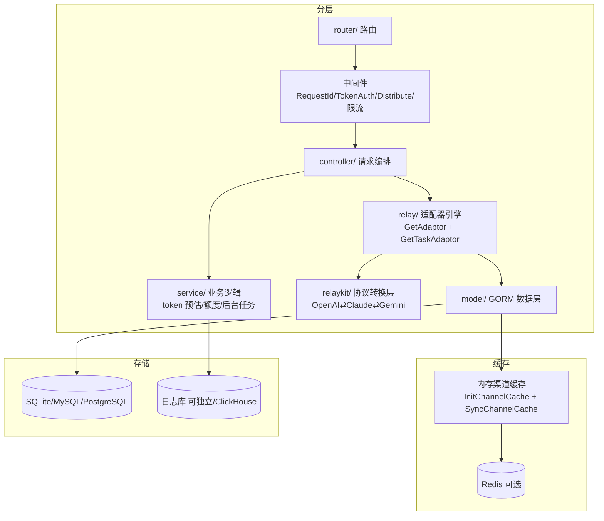

# new-api

> **one-api 的下一代二开**：更现代的 UI、缓存计费、Realtime API、任务型渠道（Midjourney/Suno）、多机部署。
> 当前中文 AI 中转站事实标准，社区最活跃。

## 项目卡片

| 项 | 值 |
|---|---|
| 仓库 | [QuantumNous/new-api](https://github.com/QuantumNous/new-api) |
| Star | ~45.7k |
| 语言 | Go + React |
| 协议 | AGPL-3.0 |
| 官方文档 | [docs.newapi.pro](https://docs.newapi.pro/en/docs) |
| 技术架构页 | [Technical Architecture](https://docs.newapi.pro/en/docs/guide/wiki/basic-concepts/technical-architecture) |
| 代码分析 | [DeepWiki](https://deepwiki.com/QuantumNous/new-api) |

## 相比 one-api 的增量（值得注意的）

- **缓存计费**：命中 prompt 缓存按比例（如 50%）计费，OpenAI/Azure/DeepSeek/Claude 支持
- **OpenAI Realtime API**（WebSocket）、**Responses API**、Claude Messages 直通
- **任务型渠道**：Midjourney / Suno（异步任务轮询）
- **模型级限流**：总请求数 / 成功请求数
- **thinking_to_content**：把 `reasoning_content` 转成 `<think>` 标签拼进 content
- 多机部署：Session/Redis 缓存校验、`CRYPTO_SECRET` 一致性要求
- 独立 `relaykit` 模块做协议转换（OpenAI ⇄ Claude ⇄ Gemini）

## 架构



## 请求生命周期（DeepWiki 提炼）

1. **认证**：`TokenAuth` 校验 Bearer 令牌 → 用户/分组/额度
2. **渠道选择**：`Distribute` 按 分组+模型 从缓存索引选渠道（支持权重随机）
3. **token 预估**：`EstimateRequestToken` 按模型类型计算文本/图片/音频 token
4. **中继**：`GetAdaptor` 拿到渠道适配器 → `ConvertRequest` 格式转换 → `DoRequest` 发上游 → `DoResponse` 回填 usage
5. **计费**：额度 = 分组倍率 × 模型倍率 × tokens（支持缓存计费比例、thinking 倍率）
6. **异步回写**：后台任务 `UpdateQuotaData` 聚合用量、`SyncChannelCache` 同步渠道

## 代码阅读路线

```
main.go                        # 初始化 + 路由 + 后台任务
middleware/token.go            # 认证
middleware/distribute.go       # 分发/负载均衡
controller/relay.go            # 中继编排
relay/relay_adaptor.go         # GetAdaptor 工厂
relaykit/                      # ★ 协议转换（OpenAI⇄Claude⇄Gemini）
service/token_counter.go       # ★ token 预估（文本/图片/音频）
relay/                        # 各渠道适配器
model/cache.go                # 内存渠道缓存
docs/authentication.md        # 令牌契约文档
```

## 对 RelayHub 的启发

1. **协议转换独立成模块（relaykit）**—— RelayHub 若要做 Claude/Gemini 格式支持，应该像这样把转换逻辑和路由解耦。
2. **缓存计费 / thinking 倍率** 是真实用户需求，插件化时值得做成"计费策略插件"。
3. **任务型渠道（异步任务轮询）** 是适配器模式的延伸：RelayHub 插件接口要考虑"同步透传"和"异步任务"两种形态。
4. 反面教材依旧：**AGPL 传染 + 全家桶**，RelayHub 只学习其 relay 层的设计，不碰其管理后台/DB 部分。

---

# 模块清单表

| 模块（源码路径） | 职责 | 关键文件 |
|---|---|---|
| `main.go` | 入口：初始化资源/DB/缓存/后台任务 → 挂路由 | `main.go` |
| `router/` | 路由：`/v1/*`（chat/responses/messages/embeddings/images/realtime/rerank）+ 管理 API | `router/` |
| `middleware/` | 认证（TokenAuth）、分发（Distribute）、限流、i18n、panic 恢复 | `middleware/` |
| `controller/` | 请求编排：中继主入口、渠道自动更新、任务管理 | `controller/relay.go` |
| `relay/` | **适配器引擎**：`GetAdaptor`（同步渠道）、`GetTaskAdaptor`（异步任务渠道）、各厂商 handler | `relay_adaptor.go`, `relay_task.go`, `claude_handler.go`, `gemini_handler.go` 等 |
| `relaykit/` | **独立协议转换库**：OpenAI ⇄ Claude ⇄ Gemini 格式互转 | `relaykit/` |
| `service/` | 业务逻辑：token 预估（文本/图片/音频）、额度聚合、后台任务 | `token_counter.go` |
| `model/` | GORM 数据层 + 内存渠道缓存 | `cache.go` |
| `constant/` `dto/` `types/` | 常量 / 数据传输对象 / 类型定义 | `constant/` |
| `oauth/` | 第三方授权登录（GitHub/飞书/Telegram 等） | `oauth/` |
| `setting/` | 系统设置项管理（OptionMap） | `setting/` |
| `logger/` | 日志 | `logger/` |
| `common/` `pkg/` | 公共工具 | `common/` |
| `web/` | React 管理后台 | `web/` |

## new-api 与 one-api 的模块差异（增量点）

| 差异 | 说明 |
|---|---|
| `relaykit/` 独立协议转换库 | one-api 的转换逻辑散在各 adaptor 里；new-api 抽成独立库，**路由与转换解耦** |
| `service/` 独立业务层 | one-api 的 token 预估/额度逻辑在 controller 里；new-api 抽成 service 层 |
| `relay_task.go` 任务型适配器 | Midjourney/Suno 这类异步任务：提交 → 轮询 → 回调，`GetTaskAdaptor` 单独管理 |
| `websocket.go` Realtime API | WebSocket 透传（OpenAI Realtime） |
| `oauth/` | 多登录方式（one-api 只有邮箱/GitHub） |
| `constant/` `dto/` | 类型更规范（AGPL 项目更工程化） |
