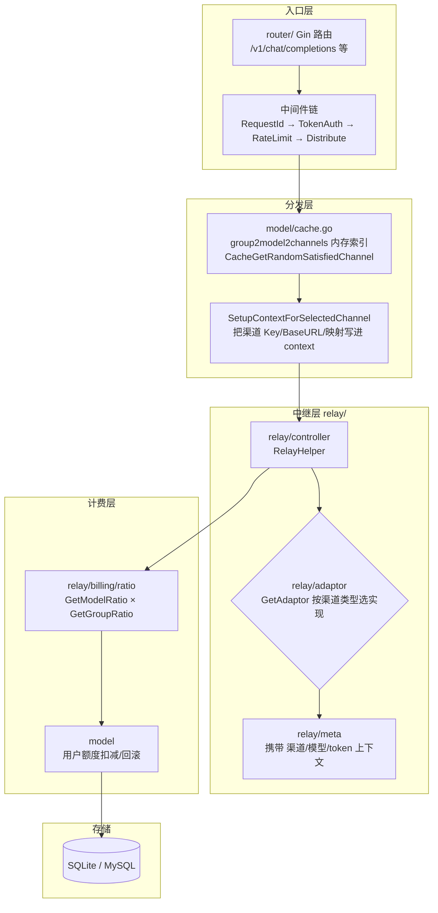
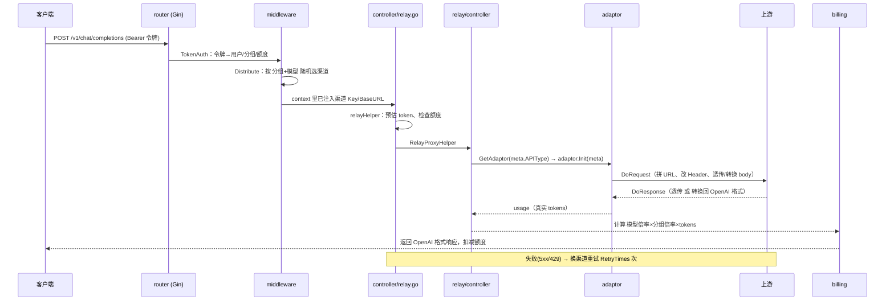

# one-api

> **LLM API 管理 & 分发系统的鼻祖**：把几十家上游统一成一个 OpenAI 兼容接口，带渠道管理、令牌、计费、Web 后台。
> 作者 songquanpeng 已停更维护（last commit ~1 年前），但它奠定了整个中文 AI 中转站的架构范式。

## 项目卡片

| 项 | 值 |
|---|---|
| 仓库 | [songquanpeng/one-api](https://github.com/songquanpeng/one-api) |
| Star | ~36.5k |
| 语言 | Go 37% + JavaScript 62% (React) |
| 协议 | MIT |
| 官方文档 | [README](https://github.com/songquanpeng/one-api/blob/main/README.md) |
| 代码分析 | [DeepWiki](https://deepwiki.com/songquanpeng/one-api) |

## 核心能力

- 统一 OpenAI 格式访问 30+ 家模型（OpenAI/Azure/Claude/Gemini/国产全家桶/Ollama 等）
- 渠道管理：批量创建、分组、优先级、模型列表、模型映射（`gpt-3.5` → 真实模型名）
- 令牌管理：额度、过期时间、IP 白名单、可指定渠道
- 负载均衡：同优先级渠道随机分发，失败自动重试换渠道
- 计费：`额度 = 分组倍率 × 模型倍率 × tokens`，流式返回时回填 usage
- 多机部署（需要 MySQL + Redis + 主从节点）

## 架构



## 请求链路（一次 chat 请求完整走一遍）



## 代码阅读路线

```
main.go                 # 入口：初始化 + 路由挂载
router/relay.go         # /v1/* 中继路由
middleware/token.go     # 令牌认证
middleware/distributor.go  # ★ 渠道分发核心：CacheGetRandomSatisfiedChannel
model/cache.go          # ★ 内存渠道索引 group2model2channels
controller/relay.go     # ★ 中继编排 + 失败重试逻辑
relay/relay_adaptor.go  # GetAdaptor：渠道类型 → 适配器
relay/adaptor/interface.go  # ★ Adaptor 接口定义（插件化参照物）
relay/adaptor/openai/   # OpenAI 适配器（最标准的实现）
relay/adaptor/anthropic/ # 格式转换示例
relay/meta/relay_meta.go  # Meta：一次请求的全部上下文
relay/billing/ratio/    # 模型倍率表 + 分组倍率
```

## 对 RelayHub 的启发

1. **`Adaptor` 接口是插件化的天然边界** —— RelayHub 的插件机制可以直接照抄这套方法签名。
2. **内存渠道索引 `group2model2channels`** —— 不查库也能 3 秒启动、O(1) 选渠道；RelayHub 把"建索引"从启动时数据库读改成读 `config.yaml` 即可。
3. **失败重试**：`shouldRetry` 只对 5xx/429 重试，4xx 直接返回，重试时跳过上次失败的渠道 —— 这套逻辑值得原样搬。
4. 反面教材：**为了管理后台 + 多租户引入了全套 DB/前端/登录**，导致内存几百 MB —— RelayHub 全砍。

---

# 模块清单表

| 模块（源码路径） | 职责 | 关键文件 |
|---|---|---|
| `main.go` | 入口：加载配置 → 初始化 DB/缓存/后台任务 → 挂路由 → 启动 | `main.go` |
| `router/` | Gin 路由：`/v1/*` 中继路由 + `/api/*` 管理路由 | `relay.go` |
| `middleware/` | **请求管道**：令牌认证（`TokenAuth`）、限流、渠道分发（`Distribute`）、系统提示注入 | `token.go`, `distributor.go` |
| `controller/` | HTTP 编排：`Relay`（中继主入口 + 失败重试循环）、管理接口 handler | `relay.go` |
| `relay/` | **中继引擎**：`controller`（转发编排）、`adaptor`（渠道适配器）、`meta`（请求上下文）、`billing`（计费）、`channeltype`（渠道类型常量）、`relaymode`（接口类型） | `relay_adaptor.go`, `adaptor/interface.go`, `billing/ratio/` |
| `model/` | GORM 数据层：User/Channel/Token/Ability/Log + **内存渠道缓存**（`group2model2channels`） | `cache.go`, `channel.go` |
| `monitor/` | 渠道健康监控：失败计数、自动禁用渠道 | `monitor.go` |
| `common/` | 公共配置/日志/工具 | `config/` |
| `web/` | React 管理后台（3 套主题：default/berry/air） | `web/` |

## 核心模块间关系（文字版）

1. **启动**：`main.go` 初始化 DB → `model.InitChannelCache` 构建内存索引（group → model → channels 列表）→ 挂路由 → 后台任务（渠道余额刷新/模型同步）。
2. **请求**：`router` → `middleware` 链（认证→限流→分发）→ `controller.Relay` → `relay/controller.RelayProxyHelper` → `relay.GetAdaptor` 按渠道类型取适配器 → `DoRequest/DoResponse` → 计费回写。
3. **失败重试**：`controller.Relay` 里循环：失败(5xx/429) → `CacheGetRandomSatisfiedChannel` 换渠道 → `SetupContextForSelectedChannel` 重新注入 → 再试，直到 `RetryTimes` 用完。
4. **渠道健康**：`monitor` 记录每次成功/失败，连续失败触发 `DisableChannel`（后续请求跳过该渠道）。
