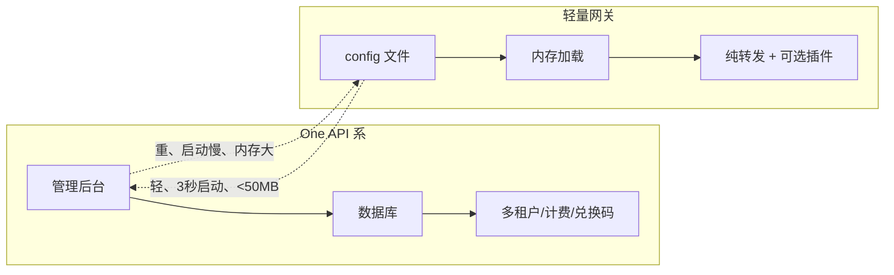

# 02 · 轻量网关/代理 —— 配置优先，无数据库

> 这一类才是 RelayHub 真正的同类：**不搞管理后台，配置文件一把梭，能转发就行**。
> 重点研读 simple-one-api 和 LiteLLM 的架构。

| 项目 | Star | 语言 | 定位 | 协议 |
|---|---|---|---|---|
| [simple-one-api](./simple-one-api.md) | 2.3k | Go | 单文件 + config.json，无数据库，自带 WebUI | MIT |
| [LiteLLM](./litellm.md) | 56.8k | Python | SDK + Proxy 双层，翻译层设计教科书 | MIT |
| [Portkey Gateway](./portkey-gateway.md) | 12.8k | TypeScript | 极轻量（<1ms/122kb），可跑 Cloudflare Workers | MIT |
| [openai-forward](./openai-forward.md) | ~1k | Python | 纯转发 + 缓存 + 限流，已归档 | MIT |

## 与 One API 系的本质区别

## 偷师清单

1. **simple-one-api**：`config.json` 定义 provider/models/keys 的写法、路由策略（随机/首选/轮询/hash）、无数据库设计 —— **RelayHub 最直接的参照物**。
2. **LiteLLM**：翻译层 `transform_request/transform_response` 的隔离设计、Router 的 TPM/RPM 限流与冷却、`model_prices.json` 统一价格表 —— **插件化 + 计费插件的范本**。
3. **Portkey**：Gateway 与 SDK 分离、配置 JSON 声明式路由、重试/回退策略 —— 轻量的正确姿势。
4. **openai-forward**：通用转发 + 智能缓存 + 异步性能 —— 已归档，但缓存思路可借鉴。
