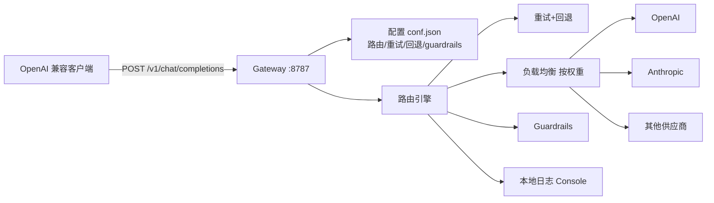

# Portkey AI Gateway

> **极轻量路线代表**：<1ms 延迟、122kb 体积，TypeScript 实现，可以跑在 Cloudflare Workers 上（免费额度）。
> 理念：Gateway 只做转发/路由/重试/回退，复杂业务全在配置里声明。

## 项目卡片

| 项 | 值 |
|---|---|
| 仓库 | [Portkey-AI/gateway](https://github.com/Portkey-AI/gateway) |
| Star | ~12.8k |
| 语言 | TypeScript（Rollup 打包单文件） |
| 协议 | MIT |
| 官方文档 | [portkey.wiki](https://portkey.wiki/gh-1) |
| 部署 | [docs/installation-deployments.md](https://github.com/Portkey-AI/gateway/blob/main/docs/installation-deployments.md) |

## 核心能力

- 250+ LLM 一个 API 接入，45+ 供应商
- 自动重试（指数退避）、失败回退（fallback 到另一家）
- 负载均衡（多 Key/多供应商按权重）
- Guardrails（输入输出校验，40+ 预置）
- 虚拟 Key 管理、缓存、成本统计
- 可部署：Node.js / Docker / Cloudflare Workers / Replit

## 架构



## 使用方式（感受轻量）

```bash
npx @portkey-ai/gateway        # 一键起网关
```

```js
const config = {
  "retry": {"attempts": 5},
  "output_guardrails": [{ "default.contains": {"operator": "none", "words": ["Apple"]}, "deny": true }]
};
```

所有策略用**配置对象**声明式挂到请求上，代码不用改 —— 这就是"配置驱动"的路子。

## 对 RelayHub 的启发

1. **122kb 单文件**：证明网关核心可以极其小；RelayHub 的 <50MB 内存目标完全可行。
2. **Cloudflare Workers 部署形态**：无服务器网关是 RelayHub 可以考虑的附加部署目标（Go 可编译 WASM）。
3. **声明式配置 + 运行时挂载**：`with_options(config=...)` 的思路 → RelayHub 插件可以在请求级附加策略（计费/缓存/护栏）。
4. Guardrails 概念：RelayHub 的"过滤插件"可以参考其规则 DSL（`contains/deny`）。

---

# 模块清单表

| 模块（源码路径） | 职责 | 关键文件 |
|---|---|---|
| `src/index.ts` / `start-server.ts` | 入口：HTTP server 启动 / Workers handler | `index.ts` |
| `src/handlers/` | **各 API 端点 handler**：chat/completions、embeddings、images、realtime、messages、models、batch 等 | `chatCompletionsHandler.ts`, `modelsHandler.ts`, `realtimeHandler.ts` |
| `src/handlers/retryHandler.ts` | **重试+回退**：指数退避重试、失败 fallback 到其他 provider | `retryHandler.ts` |
| `src/handlers/streamHandler.ts` | SSE 流式转发 | `streamHandler.ts` |
| `src/services/` | **请求转换**：OpenAI 格式 → 各供应商格式；条件路由；realtime 事件解析 | `transformToProviderRequest.ts`, `conditionalRouter.ts` |
| `src/providers/` | **供应商适配器**：每家一个目录（openai/anthropic/gemini/...），`api.ts` + `chatComplete.ts` + `utils.ts` | `providers/openai/` 等 |
| `src/middlewares/` | 认证（adminAuth）、缓存（cache）、hooks、日志、请求校验 | `middlewares/` |
| `src/shared/services/cache/` | 缓存后端：memory / file / redis / cloudflareKV | `cache/backends/` |
| `src/errors/` | 错误定义 | `errors/` |
| `conf.json` | **网关配置**：端口、provider 凭据、默认策略 | 根目录 |

## 请求数据流（文字版）

1. 客户端 → handler（如 `chatCompletionsHandler`）。
2. 中间件链：请求校验 → 缓存检查（命中直接返回）→ hooks → 日志。
3. handler 调用 `retryHandler`：按配置的重试次数/退避策略发起请求。
4. `transformToProviderRequest` 把 OpenAI 格式转成目标供应商格式 → `providers/{vendor}/` 发 HTTP。
5. 失败时按 fallback 配置换供应商重试。
6. 响应（或 SSE 流）经 `streamHandler` 透传回客户端。
7. 全程配置驱动：`conf.json` + 请求级 `config` 对象（`with_options`）控制一切策略。
