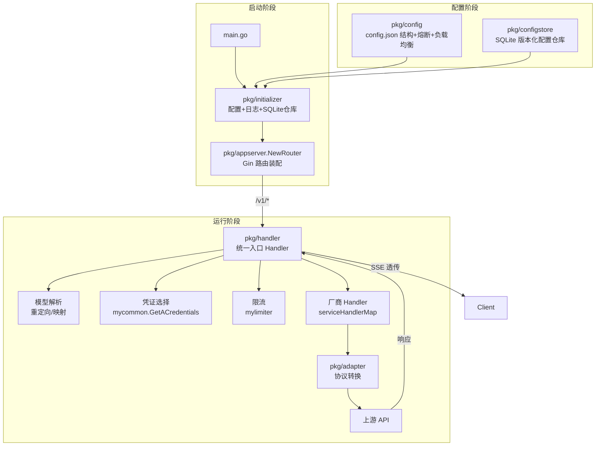
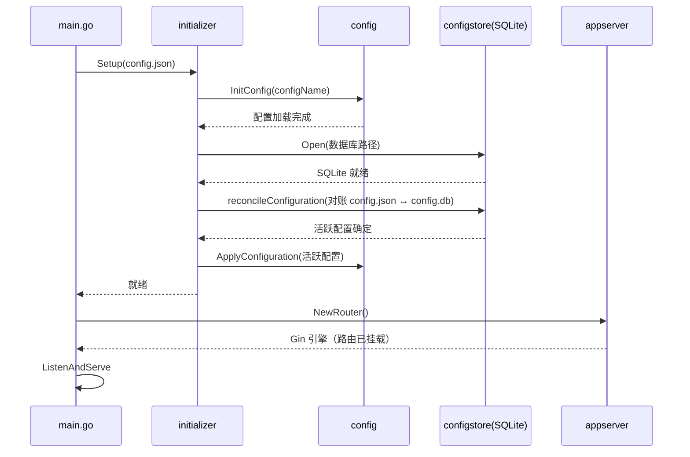
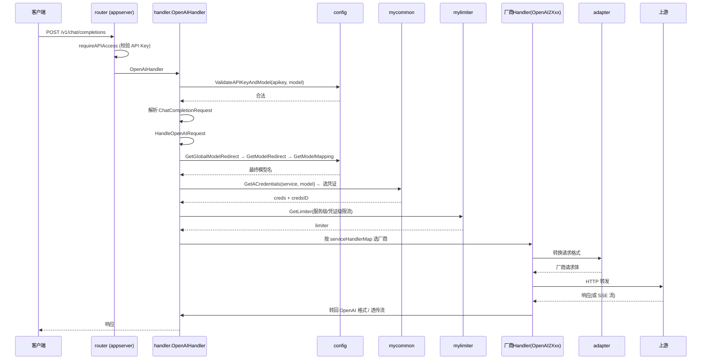

# simple-one-api

> ⭐ **RelayHub 定位最接近的项目**：Go 单文件、`config.json` 一把梭、无数据库（仅可选 SQLite 存配置）、自带内嵌 WebUI 和 Wails 桌面端。
> 它就是"One API 系太重，我只想自己用"这个需求的答案。

## 项目卡片

| 项 | 值 |
|---|---|
| 仓库 | [fruitbars/simple-one-api](https://github.com/fruitbars/simple-one-api) |
| Star | ~2.3k |
| 语言 | Go 1.25+ (Wails v2 桌面端) + React (web/) |
| 协议 | MIT |
| 官方文档 | [docs/](https://github.com/fruitbars/simple-one-api/blob/main/docs/README.md) |
| 配置参考 | [docs/configuration-reference.md](https://github.com/fruitbars/simple-one-api/blob/main/docs/configuration-reference.md) |
| 架构说明 | [docs/architecture-v1.md](https://github.com/fruitbars/simple-one-api/blob/main/docs/architecture-v1.md) |
| 设计文档 | [DESIGN.md](https://github.com/fruitbars/simple-one-api/blob/main/DESIGN.md) |

## 核心能力

- 三种客户端协议：OpenAI Chat Completions `/v1/chat/completions`、Responses `/v1/responses`、Anthropic Messages `/v1/messages`、`/v1/models`、Embeddings
- 多 Provider / 多模型 / 多组凭证
- 路由策略：随机（random）、首选（primary）、轮询（round-robin）、哈希（hash）
- 全局/Provider 代理、限流、模型别名、翻译、多模态路由
- Provider/模型粒度熔断 + 半开恢复
- 内嵌 React 聊天界面（go:embed 打进单文件）
- 配置台：可视化编辑或切源码，SQLite 存配置、运行时原子生效
- Wails 桌面端，与 Web 共用 Go 路由

## 架构

```mermaid
flowchart LR
    subgraph 入口
        main[main.go]
        Server[HTTP Server :9090]
    end
    subgraph 路由
        API[/v1/chat/completions<br/>/v1/responses /v1/messages /v1/models]
        WebUI[/ 配置台 + /chat 聊天页]
    end
    subgraph 核心
        Router[路由引擎<br/>random/primary/round-robin/hash]
        Provider[Provider 适配]
        Breaker[熔断 + 半开恢复]
    end
    subgraph 配置
        Config[config.json / YAML]
        SQLite[(SQLite config.db 可选)]
    end

    main --> Server
    Server --> API
    Server --> WebUI
    API --> Router
    Router --> Provider
    Provider --> Breaker
    Breaker --> Upstream[上游 API]
    Router --> Config
    Config --> SQLite
```

## 最小配置（感受一下）

```json
{
  "server_port": ":9090",
  "enable_web": true,
  "log_level": "info",
  "services": {}
}
```

Provider 的模型、多组凭证、代理、限流、熔断全在配置里声明 —— **没有任何数据库表结构**。

## 对 RelayHub 的启发（重点研读）

1. **配置结构设计**：`config.json` 里 provider/models/keys 的组织方式值得直接借鉴，RelayHub 的 `config.yaml` 可以保持等价能力。
2. **路由策略枚举**：random / primary / round-robin / hash —— 这是"个人用"场景更合适的负载均衡（One API 系只有权重随机）。
3. **熔断 + 半开恢复**：Provider 级别健康状态管理，RelayHub 内核该内置（或作为插件）。
4. **协议三合一**：`/v1/chat/completions` + `/v1/responses` + `/v1/messages` 三个入口同一套路由 —— RelayHub 如果只做 OpenAI 兼容，也可以预留 Responses/Claude 入口。
5. **go:embed 内嵌前端** —— 单文件交付的关键手段（RelayHub 若将来要 WebUI 就这么干）。
6. 它的 SQLite 只是"配置仓库"，不是业务库 —— 与 RelayHub"配置文件一把梭"不冲突。

---

# 逻辑框架（源码级）

> 以下基于本地源码 `simple-one-api/`（submodule）逐文件梳理。

## 一、模块清单表

| 模块（源码路径） | 职责 | 关键文件 |
|---|---|---|
| `main.go` | 入口：读 config 路径 → `initializer.Setup` → 起 HTTP server | `main.go` |
| `pkg/initializer` | 启动装配：配置初始化、SQLite 配置仓库开启与对账（config.json ↔ config.db） | `initializer.go` |
| `pkg/appserver` | **路由装配**：Gin 引擎、CORS、`/v1/*` 统一分发（按路径后缀分流）、admin API、内嵌前端 | `router.go`, `auth.go` |
| `pkg/apis` | HTTP handler 层：`/v1/models`、admin 配置管理（draft/validate/publish/activate）、日志 | `models_handler.go`, `admin_config_handler.go` |
| `pkg/handler` | **核心转发引擎**：`OpenAIHandler`（校验 Key→解析→分发）、`ResponsesHandler`、`AnthropicMessagesHandler`、各厂商转换 handler | `openai_handler.go`, `client_compat.go`, `openai_*_handler.go` |
| `pkg/adapter` | **协议适配器**：OpenAI 格式 → 各家请求结构（多模态 content 转换等） | `openai_openai.go`, `gemini_openai.go`, `claude_openai.go` 等 |
| `pkg/config` | 配置定义、**熔断器**、**负载均衡策略**、模型重定向/映射 | `config.go`, `circuit_breaker.go`, `lb_strategy.go` |
| `pkg/configstore` | SQLite 配置仓库：配置版本化（revision）、活跃配置、checksum 对账 | `store.go` |
| `pkg/mycommon` | 公共逻辑：**凭证选择**、模型详情解析、消息参数解析 | `common_credentials.go`, `common_modeldetails.go` |
| `pkg/mylimiter` | 限流器：qps / qpm / rpm / tpm（服务级或凭证级） | `limiter.go` |
| `pkg/llm` | 各厂商 LLM 的请求/响应结构定义 | `pkg/llm/*/` |
| `pkg/mylog` | zap 日志 + 实时日志视图 | `logger.go`, `live.go` |
| `pkg/embedding` | Embeddings 接口转发 | `embeddings_handler.go` |
| `pkg/translation` | 翻译接口（v1/v2） | `translate_handler_v1.go` |
| `pkg/utils` | HTTP 工具、API Key 提取等 | `http_request.go`, `gin_utils.go` |
| `web/` + `internal/webui` | React 前端（聊天页 + 配置台），`go:embed` 打进单文件 | `internal/webui/` |

## 二、模块协作图



**一句话**：请求进来 → 校验 Key → 解析模型 → 按"服务+模型"选渠道凭证 → 限流 → 按厂商适配器转换格式 → 转发上游 → 流式回传。

## 三、请求时序图

### 启动时序



### 一次 /v1/chat/completions 请求



## 四、请求数据流（文字版）

1. **入口路由**：`POST /v1/chat/completions`（或 `/v1/responses`、`/v1/messages`、`/v1/embeddings`）→ `requireAPIAccess` 中间件提取并校验 Bearer Key。
2. **模型解析与重定向**：客户端模型名 → 全局重定向（`GetGlobalModelRedirect`）→ 服务模型名 → 模型重定向（`GetModelRedirect`）→ 模型映射（`GetModelMapping`）→ 最终发给上游的模型名。
3. **服务/凭证选择**：`getModelDetails` 按模型名定位 Service（配置里的服务），`GetACredentials` 按负载均衡策略选凭证。
4. **限流**：服务级或凭证级限流（qps/qpm/rpm/tpm），超时等待。
5. **厂商适配**：`serviceHandlerMap` 按服务名选 handler（openai/claude/gemini/qianfan…），handler 内部用 adapter 转换请求/响应格式。
6. **流式处理**：`stream: true` 时透传 SSE 流，逐块转发。
7. **熔断**：请求失败计数触发熔断，半开恢复（`config/circuit_breaker.go`）。

## 五、核心设计要点（源码观察）

1. **`serviceHandlerMap` 是插件化的雏形**：`"qianfan": OpenAI2QianFanHandler` 这种映射表 + 各厂商独立 handler 文件，新增厂商=加一个 map 项+一个文件，主流程不动。
2. **配置即数据**：服务/模型/凭证/代理/限流全在 `config.json`，代码里 `config.CurrentConfiguration()` 全局访问，运行时可通过配置台热更新（版本化 + 激活）。
3. **凭证选择器**：`GetACredentials` 按负载均衡策略（随机/首选/轮询/哈希）从多组凭证里选一组，选完缓存。
4. **限流分级**：先查服务级限制，没有再查凭证级限制 —— 两级兜底。
5. **SQLite 只做配置版本仓库**：`configstore` 存 revision/active/checksum，不做任何业务数据 —— 印证"配置一把梭"路线下 DB 的合理位置。
