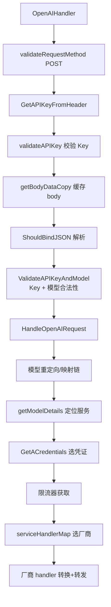

# simple-one-api 模块分析

> 对核心模块的代码级拆解。逻辑框架总览见 [simple-one-api.md](./simple-one-api.md)。

## 1. `pkg/handler` —— 核心转发引擎（最重要）

**职责**：所有 `/v1/*` 请求的统一入口 + 厂商分发。

**关键结构**：

```go
// 服务名 → 厂商转换 handler 的映射表（插件化的雏形）
var serviceHandlerMap = map[string]func(*gin.Context, *OAIRequestParam) error{
    "qianfan":   OpenAI2QianFanHandler,
    "hunyuan":   OpenAI2HunYuanHandler,
    "xinghuo":   OpenAI2XingHuoHandler,
    "openai":    OpenAI2OpenAIHandler,
    "azure":     OpenAI2AzureOpenAIHandler,
    "deepseek":  OpenAI2OpenAIHandler,   // 注意：deepseek 复用 openai handler
    "zhipu":     OpenAI2OpenAIHandler,
    "gemini":    OpenAI2GeminiHandler,
    "claude":    OpenAI2ClaudeHandler,
    "ollama":    OpenAI2OllamaHandler,
    // ... 共 17 个服务
}
```

**`OpenAIHandler` 流程**（`openai_handler.go`）：



**`OAIRequestParam`**：一次请求的全部上下文（ctx/请求体/模型详情/凭证/HTTP transport/客户端模型名/reasoning 模式/额外字段），在各厂商 handler 间传递。

## 2. `pkg/config` —— 配置中枢 + 熔断 + 负载均衡

**职责**：全局配置（`config.CurrentConfiguration()`）、熔断器、LB 策略、模型重定向。

- `config.go`：配置结构定义 + `InitConfig` + `ApplyConfiguration`（运行时热更新）
- `circuit_breaker.go`：熔断器（失败计数 → 断开 → 半开探测 → 恢复）
- `lb_strategy.go`：负载均衡策略（random / primary / round-robin / hash）
- `proxy_strategy.go`：代理策略（全局/服务级代理）
- `runtime.go`：运行时变量（当前端口等）

**模型名三级变换**（`HandleOpenAIRequest` 中观察）：
```
客户端模型 → GetGlobalModelRedirect → GetModelRedirect(服务级) → GetModelMapping → 上游模型
```

## 3. `pkg/configstore` —— SQLite 配置版本仓库

**职责**：把 `config.json` 变成可版本化的配置（revision 机制）。

- `Open`：打开/创建 SQLite（默认 `config.db`，可用 `SIMPLE_ONE_API_DB` 覆盖）
- `CreateRevision / Active / Metadata / Checksum`：配置版本管理
- `reconcileConfiguration`：启动时对账 —— config.json 的 checksum 变了就导入新 revision；没变就用活跃配置

**设计启示**：SQLite 在这里不是"业务数据库"，而是"配置的持久化层"，让配置台能原子生效、可回滚。RelayHub 若纯 config.yaml 一把梭，可不要这层，但"配置版本化"的想法值得留。

## 4. `pkg/adapter` —— 协议适配器

**职责**：OpenAI 请求/响应 ↔ 各厂商格式。

- `openai_openai.go`：OpenAI 系直接透传
- `gemini_openai.go` / `claude_openai.go` / `hunyuan_openai.go` 等：格式转换
- 多模态：`OpenAIMultiContentRequestToOpenAIContentRequest`（vision 请求规范化）

## 5. `pkg/mylimiter` —— 限流器

**职责**：qps / qpm / rpm / tpm 限流。

- `GetLimiter(serviceID, type, num)`：按服务或凭证取限流器（内部缓存）
- `limiter.Wait(ctx)`：令牌等待，超时返回错误

**分级逻辑**（`HandleOpenAIRequest` 中观察）：先查服务级限制 → 没有则查凭证级限制。

## 6. `pkg/appserver` —— 路由装配

**职责**：Gin 引擎构建 + 路由注册 + 中间件。

- `/v1/*` 统一入口：按 URL 后缀分流到 `ResponsesHandler` / `AnthropicMessagesHandler` / `OpenAIHandler` / Embeddings / Translation
- `/api/admin/*`：配置管理（`requireAdminAccess` 保护）
- `/healthz`：健康检查
- 内嵌前端注册（`webui.Handler()`）+ SPA fallback

## 7. `pkg/initializer` —— 启动装配

**职责**：初始化顺序控制（`once.Do` 保证单次）。

```
config.InitConfig → openConfigurationRepository(SQLite) → reconcileConfiguration → gin mode → mylog.InitLog
```

## 8. 其他辅助模块

| 模块 | 说明 |
|---|---|
| `pkg/mycommon` | 凭证选择、模型详情、消息解析（`ParseChatCompletionRequest` 兼容多种消息结构） |
| `pkg/mylog` | zap 日志 + 实时日志（WebSocket 推给配置台） |
| `pkg/llm` | 各厂商请求/响应结构体定义（纯数据层） |
| `pkg/embedding` / `pkg/translation` | 附加接口 |
| `pkg/utils` | HTTP 工具、API Key 提取 |
| `web/` | React 前端（配置台 + 聊天页），构建后 `go:embed` 进单文件 |
