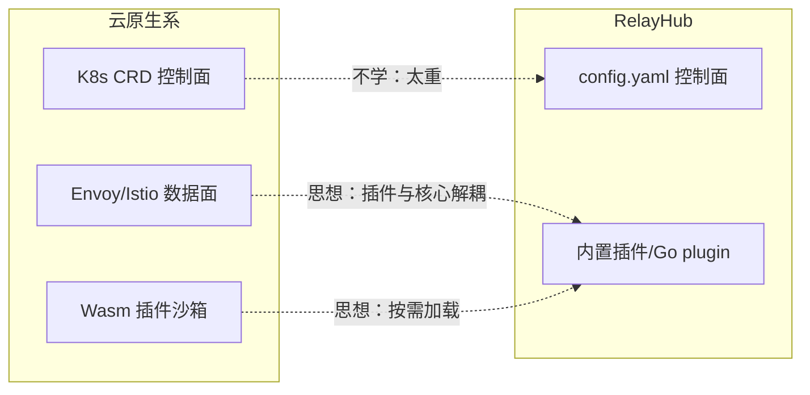

# 03 · 云原生/企业级网关

> 这一类面向 K8s 集群：基于 Envoy/Istio，Wasm 插件扩展，毫秒级配置生效。
> RelayHub 不部署在 K8s，但它们的 **Wasm 插件机制**和 **AI 原生能力**（协议转换、流式处理）有借鉴价值。

| 项目 | Star | 语言 | 定位 | 协议 |
|---|---|---|---|---|
| [Higress](./higress.md) | 9.2k | Go (Envoy + Istio) | AI Native API 网关，Wasm 插件，CNCF 项目 | Apache-2.0 |
| [Envoy AI Gateway](./envoy-ai-gateway.md) | 1.9k | Go (Envoy Gateway) | 标准 AI 网关，支持 MCP | Apache-2.0 |

## 与 RelayHub 的关系

## 偷师清单

1. **Wasm 插件沙箱**：插件和网关进程隔离、可独立升级、热更新 —— RelayHub 插件系统要保证"插件崩了内核不崩"。
2. **AI 协议转换**：Higress 的 `ai-proxy` 插件把各家模型统一成 OpenAI 格式 —— 协议转换作为插件而非内核。
3. **流式 SSE 处理**：Envoy 级流式处理显著降低内存 —— Go 里用 `io.Copy` + 逐块转发即可，别整块缓冲。
