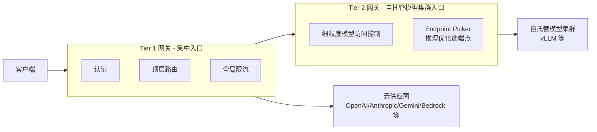

# Envoy AI Gateway

> **Envoy Gateway 官方 AI 网关**：CNCF 生态里"标准 AI 网关"的代表，支持 MCP，双层网关架构。
> 与 Higress 思路类似但更"纯 Envoy"，代表云原生 AI 网关的演进方向。

## 项目卡片

| 项 | 值 |
|---|---|
| 仓库 | [envoyproxy/ai-gateway](https://github.com/envoyproxy/ai-gateway) |
| Star | ~1.9k |
| 语言 | Go（基于 Envoy Gateway + Kubernetes Gateway API） |
| 协议 | Apache-2.0 |
| 文档 | [aigateway.envoyproxy.io](https://aigateway.envoyproxy.io/docs) |
| 概念 | [Concepts](https://aigateway.envoyproxy.io/docs/concepts/) |

## 双层网关架构

- Tier 1：认证、顶层路由、全局限流
- Tier 2：自托管模型访问的细粒度控制、LLM 推理端点选择

## 对 RelayHub 的启发

1. **"统一入口 + 下游路由"分层**：RelayHub 也可以天然分成"入口认证层"和"渠道路由层"两段中间件。
2. **Endpoint Picker 概念**：对自托管模型按负载/健康选端点 —— 对应 RelayHub 对多个同模型渠道的负载均衡。
3. 同样是 K8s 系，RelayHub 不学部署形态，只借鉴分层思想。

---

# 模块清单表

| 模块（源码路径） | 职责 | 关键文件 |
|---|---|---|
| `api/v1alpha1` `api/v1beta1` | **CRD 定义**：Backend（上游）、EndpointPicker、BackendAuth 等 AI 网关资源 | `api/` |
| `internal/controller/` | **控制器**：watch K8s 资源 → 转成 Envoy Gateway 配置 | `controller/` |
| `internal/extproc/` | **外部处理服务**：AI 请求/响应的协议转换、认证、限流逻辑（Envoy ext_proc） | `extproc/` |
| `internal/translator/` | 配置翻译：CRD → Envoy xDS 配置 | `translator/` |
| `internal/backendauth/` `gcpauth/` | 上游认证（API Key / GCP 认证） | `backendauth/` |
| `internal/llmcostcel/` | LLM 成本计算（CEL 表达式） | `llmcostcel/` |
| `internal/mcpproxy/` | MCP 代理支持 | `mcpproxy/` |
| `internal/ratelimit/` | 限流（基于 Token 的限流） | `ratelimit/` |
| `internal/bodymutator/` `headermutator/` | 请求体/头修改 | `bodymutator/` |
| `manifests/` `examples/` | K8s 部署清单 / 示例 | `manifests/` |

## 请求数据流（文字版）

1. K8s 集群内创建 `Backend`/`EndpointPicker` 等 CRD → `controller` 监听到 → `translator` 转成 Envoy 配置。
2. 客户端请求进 Envoy Gateway → 匹配路由 → 到 `ext_proc` 外部处理服务。
3. `extproc` 做：认证（BackendAuth）、协议转换（OpenAI ⇄ 各厂商）、限流、成本统计。
4. `EndpointPicker` 按策略（负载/健康）选实际上游端点 → 转发。
5. Tier 1/Tier 2 双层部署时，Tier 2 负责自托管集群内的细粒度控制和端点选择。
