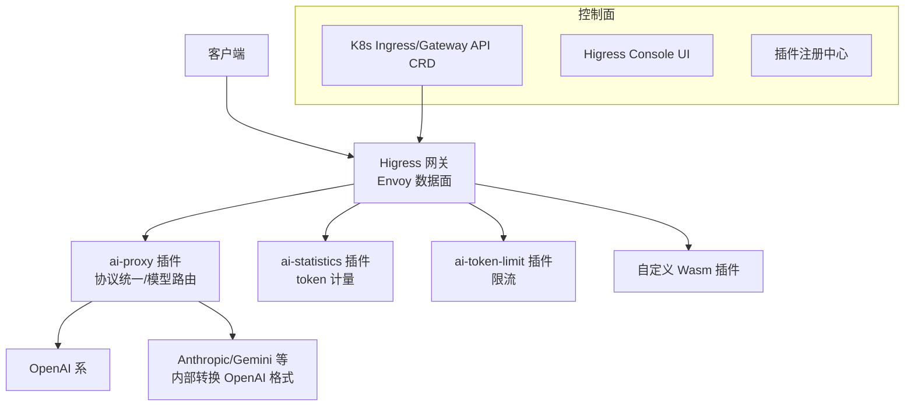

# Higress

> **阿里开源的 AI Native API 网关**（CNCF Sandbox）：基于 Istio + Envoy，Wasm 插件扩展（Go/Rust/JS 都能写）。
> AI 能力通过 `ai-proxy` 插件实现：把 30+ 家模型统一成 OpenAI 格式，支持流式、负载均衡、token 限流、缓存。

## 项目卡片

| 项 | 值 |
|---|---|
| 仓库 | [higress-group/higress](https://github.com/higress-group/higress) |
| Star | ~9.2k |
| 语言 | Go（Envoy + Istio + Wasm） |
| 协议 | Apache-2.0 |
| 官方文档 | [higress.cn/docs](https://higress.cn/en/docs/latest/overview/what-is-higress/) |
| Wasm 插件库 | [higress.cn/en/plugin](https://higress.cn/en/plugin/) |
| 架构文档 | [Developer Guide](https://higress.cn/en/docs/latest/dev/architecture/) |

## 核心能力

- **AI 网关**：统一协议接入所有主流模型供应商，AI 可观测性、多模型负载均衡、token 限流、缓存
- **MCP Server 托管**：通过插件机制托管 MCP Server，统一认证/限流/审计日志
- **Wasm 插件**：内存安全沙箱隔离、多语言（Go/Rust/JS）、插件可独立升级、流量无损热更新
- 流式处理：请求/响应体完整流式（SSE 友好），高带宽场景大幅降低内存
- 配置毫秒级生效，无 Nginx reload 抖动（长连接场景友好）

## 架构



## 对 RelayHub 的启发

1. **插件目录概念**：Higress 有"插件中心"，每个插件独立版本、独立升级 —— RelayHub 的插件也应按"独立模块 + 独立启用开关"组织。
2. **ai-proxy 的协议统一策略**：它把 Anthropic/Gemini 转成 OpenAI 格式再转发 —— RelayHub 若内置转换，只需做"入口 OpenAI 格式 → 各渠道格式"单向转换即可。
3. **token 计量插件**：`ai-statistics` 把 token 用量上报 —— 这就是 RelayHub 计费插件的雏形。
4. 反面教材：**K8s + Istio + CRD 太重**，个人用完全不需要；只取插件思想。

---

# 模块清单表

| 模块（源码路径） | 职责 | 关键文件 |
|---|---|---|
| `cmd/higress/` | 网关入口：Envoy bootstrap + 配置加载 | `cmd/higress/` |
| `pkg/` | **核心控制面**：配置转换（K8s CRD → Envoy xDS）、路由管理、控制器 | `pkg/` |
| `envoy/` | Envoy 相关：bootstrap 模板、协议支持 | `envoy/` |
| `istio/` | Istio 集成（Pilot/istiod 对接） | `istio/` |
| `api/` | CRD API 定义（Ingress/Gateway API 扩展） | `api/` |
| `plugins/` | **Wasm 插件库**：按语言分目录（wasm-go/wasm-rust/...），内含 `ai-proxy`、`ai-statistics`、`ai-token-limit` 等 AI 插件 | `plugins/wasm-go/extensions/ai-proxy/` |
| `client/` | Higress Console 前端 | `client/` |
| `hgctl/` | 命令行工具 | `hgctl/` |
| `registry/` | 插件注册中心相关 | `registry/` |
| `helm/` | K8s Helm 部署包 | `helm/` |

## AI 插件链（Higress 的 AI 能力核心）

```
ai-proxy         协议统一（OpenAI/Anthropic/Gemini → OpenAI 格式）+ 模型路由
  ↓
ai-statistics    token 计量 / 用量统计
  ↓
ai-token-limit   token 级限流
  ↓
ai-prompt-decorator / ai-cache / ai-request-router ...（自定义组合）
```

每个插件都是独立 Wasm 模块，可单独升级、热加载，互不影响 —— **这就是"插件化网关"的参考形态**。

## 请求数据流（文字版）

1. 请求进 Envoy 数据面，按 CRD 路由规则匹配。
2. Wasm 插件链按序处理：`ai-proxy` 识别模型 → 统一成 OpenAI 格式 → `ai-statistics` 记 token → `ai-token-limit` 限流。
3. 转发到上游模型供应商；响应流式返回时插件继续处理（统计、限流更新）。
4. 控制面（Pilot + Console）把配置转成 xDS 下发给 Envoy，毫秒级生效无需 reload。
