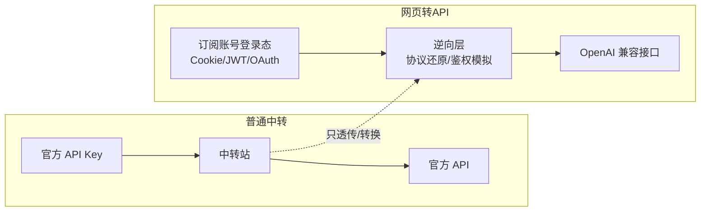

# 04 · 网页/订阅转 API（逆向类）⭐ 为插件做准备

> **这一类现在是"用不到"，但写"网页转 API 插件"时必查的弹药库。**
> 核心思路：把 **网页版/订阅账号的登录态**（Cookie、JWT、OAuth 授权）逆向转成 **OpenAI 兼容 API**，
> 让 Claude Code、Cherry Studio、New API 等标准客户端直接消费。

## 为什么单开一类

普通中转站转的是"官方 API Key"；这一类转的是"网页账号/订阅"，技术路线完全不同：

- **适用场景**：没有官方 API Key（或嫌贵），但有订阅账号；多账号拼车；官方不开放 API 的模型
- **风险提示**：违反上游 ToS，账号可能被封；RelayHub 只作为**学习参考**，不内置此类能力

## 分类结构

### 核心中转服务（订阅 → API）
| 项目 | Star | 语言 | 说明 |
|---|---|---|---|
| [sub2api](./sub2api.md) | 37.8k | Go | ⭐ 订阅账号统一转 OpenAI API，当前最火，插件直接参照物 |
| [gpt4free](./gpt4free.md) | 66.6k | Python | 聚合各网页端，FastAPI 出 OpenAI 兼容接口 |

### 官网协议逆向（单厂商深挖）
| 项目 | Star | 语言 | 说明 |
|---|---|---|---|
| [chatgpt2api](./chatgpt2api.md) | 5.9k | Python | ChatGPT 官网协议纯逆向，GPT-Image-2，号池管理 |
| [openai-cpa](./openai-cpa.md) | 1.4k | - | CPA/Sub2API/Image2API 统一控制面 |
| [pandora-next](./pandora-next.md) | 历史 | Go | 已下架，逆向类目鼻祖，仅存档参考 |

### 配套生态（号池/注册机/监控）
| 项目 | Star | 语言 | 说明 |
|---|---|---|---|
| [AutoTeam](./autoteam.md) | 1.2k | Python | ChatGPT Team 号池自动轮转，CPA/Sub2API 认证同步 |

## 写插件时的直接收获

1. **sub2api 的认证文件格式**（CPA/sub2api JSON）是社区事实标准，号池/注册机都围绕它转。
2. **gpt4free 的 Provider 抽象**：`g4f/Provider/` 每个网页端一个 adapter，和 RelayHub 的插件概念同构。
3. **逆向层的通用三步**：抓包还原协议 → 模拟鉴权（PoW/Arkose 等）→ 包一层 OpenAI 格式。

> ⚠️ 注意：sub2api 生态更新极快（2025-12 才出现，2026-08 已 37k star），仓库可能改名/换主，引用时以 GitHub 搜索为准。
