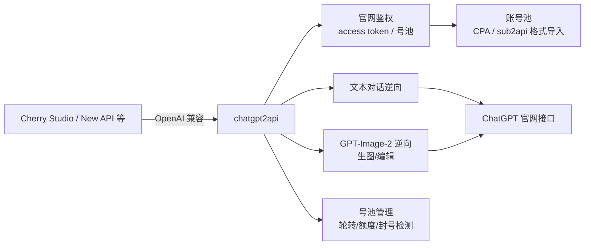

# chatgpt2api

> **ChatGPT 官网协议的纯逆向实现**（5.9k star）：不走官方 API，直接还原官网接口，
> 支持 GPT-Image-2、号池管理，兼容 OpenAI 接口协议，可导入 CPA/sub2api 号池。

## 项目卡片

| 项 | 值 |
|---|---|
| 仓库 | [basketikun/chatgpt2api](https://github.com/basketikun/chatgpt2api) |
| Star | ~5.9k |
| 语言 | Python |
| 协议 | MIT |
| 关联 | 同类还有 [yukkcat/chatgpt2api](https://github.com/yukkcat/chatgpt2api)（AGPL-3.0） |

## 核心能力

- ChatGPT 官网接口纯协议逆向（文本模型 + **GPT-Image-2 生图/编辑**）
- OpenAI 兼容接口协议
- 在线批量生图/编辑图
- **号池管理**：多账号轮转、额度监控
- 支持导入 CPA、sub2api 号池格式
- 支持可编辑 PPT/PSD 文件逆向
- 可接入 Cherry Studio、New API 等软件

## 架构

## 对 RelayHub 的启发

1. **号池管理是逆向类插件的心脏**：账号导入/轮转/封号检测/额度同步 —— 写插件时优先实现这部分。
2. **多账号额度监控**：每个号一个额度，用完自动换 —— 和普通渠道"余额不足换渠道"同构。
3. **生图类接口的逆向**：任务型接口（生图慢）需要异步轮询 —— RelayHub 的"任务型渠道"插件形态可参考。
4. 纯协议逆向（不靠浏览器自动化）是更高阶的做法，但维护成本高，官网一变就得跟着改。

---

# 模块清单表

| 模块（源码路径） | 职责 | 关键文件 |
|---|---|---|
| `main.py` | FastAPI 入口：路由装配 | `main.py` |
| `api/` | **API 路由**：OpenAI 兼容端点（chat/completions、images、models） | `api/` |
| `services/auth_service.py` | 官网鉴权：access token 获取/刷新、OAuth 登录 | `auth_service.py` |
| `services/account_service.py` | **号池管理**：账号轮转、额度监控、封号检测 | `account_service.py` |
| `services/cpa_service.py` `sub2api_service.py` | CPA / sub2api 号池格式导入导出 | `cpa_service.py` |
| `services/openai_backend_api.py` | **官网协议调用**：ChatGPT 纯协议逆向 | `openai_backend_api.py` |
| `services/image_service.py` `image_task_service.py` | GPT-Image-2 生图/编辑 + 异步任务队列 | `image_service.py` |
| `services/protocol/` | 协议层（API 请求/响应转换） | `protocol/` |
| `services/model_service.py` | 模型列表管理 | `model_service.py` |
| `services/proxy_service.py` | 代理配置 | `proxy_service.py` |
| `services/editable_file_task_service.py` | PPT/PSD 可编辑文件逆向 | `editable_file_task_service.py` |
| `web/` | Web 管理界面 | `web/` |
| `utils/` | 工具 | `utils/` |

## 请求数据流（文字版）

1. OpenAI 兼容客户端（Cherry Studio/New API）→ `/v1/chat/completions` 或 `/v1/images/*`。
2. 鉴权：API 请求带网关 Key → `auth_service` 确认网关用户 → 从号池选账号（`account_service` 按额度/状态轮转）。
3. 官网协议调用：`openai_backend_api` 用账号的 access token 调 ChatGPT 官网接口（文本/生图）。
4. 生图是异步任务：`image_task_service` 提交 → 后台轮询结果 → 完成回调。
5. 响应转 OpenAI 格式返回；`account_service` 更新该账号额度，耗尽自动换号。
6. 号池管理：`cpa_service`/`sub2api_service` 导入外部账号文件，批量注册/同步。
