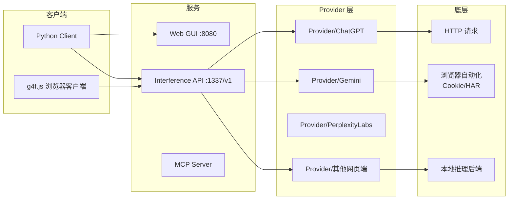

# gpt4free (g4f)

> **"网页转 API"社区最老牌项目**（66.6k star）：聚合多家网页端（ChatGPT/Gemini/Perplexity 等），
> FastAPI 暴露 OpenAI 兼容的 Interference API。Provider 抽象 + 浏览器自动化是核心看点。

## 项目卡片

| 项 | 值 |
|---|---|
| 仓库 | [xtekky/gpt4free](https://github.com/xtekky/gpt4free) |
| Star | ~66.6k |
| 语言 | Python 97% + Go (g4f-go) |
| 协议 | GPL-3.0 |
| 文档 | [g4f.dev](https://g4f.dev/) |
| API 文档 | [docs/interference-api.md](https://github.com/xtekky/gpt4free/blob/main/docs/interference-api.md) |

## 核心能力

- Python 客户端库（同步/异步）+ 本地 Web GUI
- **FastAPI Interference API**：`http://localhost:1337/v1` 兼容 OpenAI 格式
- 多 Provider 适配器（`g4f/Provider/` 每个网页端一个）
- 浏览器自动化：Chrome/Chromium 登录、Cookie/HAR 抓取
- 图像/音频/视频生成（Pollinations 等）
- MCP Server：`web_search / web_scrape / image_generation` 工具

## 架构



## Provider 抽象（和插件化同构）

新增一个网页端 = 在 `g4f/Provider/` 加一个 adapter 文件，实现统一的调用接口。
模型可用性、鉴权方式（API Key / Cookie / 无鉴权）都由 adapter 自己声明 —— 和 RelayHub 的"渠道适配器插件"是同一个模式。

## 对 RelayHub 的启发

1. **Provider 即插件**：`g4f/Provider/` 目录结构 = RelayHub 插件目录结构的现成范例。
2. **浏览器自动化兜底**：逆向拿不到纯协议时，用无头浏览器 + Cookie 兜底 —— 写网页转 API 插件时的第二方案。
3. **OpenAI 兼容 Interference API**：一层薄薄的 FastAPI 就把所有 Provider 统一了 —— 证明"统一入口"本身很轻。
4. **MCP Server 形态**：把能力暴露成 MCP 工具（web_search 等）是新趋势，RelayHub 插件未来也可考虑 MCP 出口。

---

# 模块清单表

| 模块（源码路径） | 职责 | 关键文件 |
|---|---|---|
| `g4f/Provider/` | **Provider 适配器**：每个网页端一个文件（ChatGPT/Gemini/PerplexityLabs...），实现统一调用接口 | `Provider/` |
| `g4f/client/` | Python 客户端库（`Client` 同步 / `AsyncClient` 异步，OpenAI 风格 API） | `client/` |
| `g4f/api/` | **FastAPI Interference API**：OpenAI 兼容 `/v1/*` 端点 | `api/` |
| `g4f/gui/` | Web GUI（聊天界面） | `gui/` |
| `g4f/mcp/` | MCP Server（web_search/web_scrape/image_generation 工具） | `mcp/` |
| `g4f/image/` | 图像生成/处理 | `image/` |
| `g4f/local/` `locals/` | 本地推理后端 | `local/` |
| `g4f/cookies.py` | Cookie/HAR 管理（浏览器登录态） | `cookies.py` |
| `g4f/config.py` | 配置（API Key 等） | `config.py` |
| `g4f-go/` | Go 版客户端（实验） | `g4f-go/` |
| `projects/` `models/` | 项目 / 模型定义 | `projects/` |

## Provider 调用接口（插件化范本）

每个 Provider 是一个类，声明：

```python
class ChatGPT(AsyncProvider):   # 继承统一基类
    url = "https://chatgpt.com"
    supports_stream = True      # 能力声明
    working = True
    @classmethod
    async def create_async(cls, model, messages, **kwargs):
        # 实现网页端协议调用，返回 OpenAI 格式响应
        ...
```

**新增网页端 = 加一个文件 + 实现 `create_async`**，主流程（API/客户端）零改动。

## 请求数据流（文字版）

1. 用户调用 `Client.chat.completions.create(model, messages)`。
2. Client 按模型名匹配 Provider（`Provider/` 目录里选）。
3. Provider 用其声明的鉴权方式（API Key / Cookie / 无鉴权）调用网页端接口。
4. 响应（或 SSE 流）转成 OpenAI 格式返回。
5. 走 FastAPI 时同样流程，只是入口变成 HTTP `/v1/chat/completions`。
