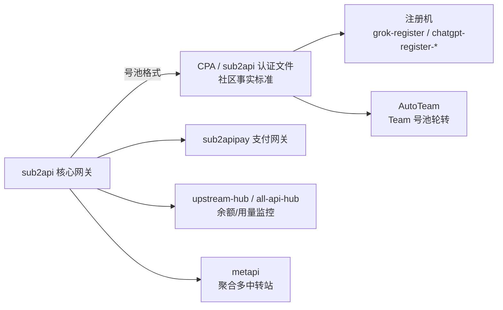

# sub2api

> ⭐ **"订阅转 API"赛道的霸主**（37.8k star，2025-12 出现，一年不到做到全网最火）。
> 核心：把 **Claude / OpenAI / Gemini / Grok 等订阅账号**统一接入，转成 OpenAI 兼容 API，支持拼车共享、原生工具（Claude Code / Codex）无缝使用。
> **这就是将来写"网页转 API 插件"最直接的参照物。**

## 项目卡片

| 项 | 值 |
|---|---|
| 仓库 | [Wei-Shaw/sub2api](https://github.com/Wei-Shaw/sub2api) |
| Star | ~37.8k（2026-08） |
| 语言 | Go |
| 协议 | LGPL-3.0 |
| 生态关键词 | 2api / antigravity2api / cc2api / claude-code / codex / crs / crs2 / gemini |
| 相关工具 | [sub2apipay](https://github.com/touwaeriol/sub2apipay)（支付网关，已归档）、[Sub2API-Tutorial](https://github.com/helloyangy/Sub2API-Tutorial)（教程） |

> ⚠️ sub2api 生态变化极快，多个同名仓库存在（如 `lieeew/sub2api` 等），地址可能变动，以 GitHub 搜索 "sub2api" 按 star 排序为准。

## 它解决什么问题

你有订阅账号但没有 API Key（或 API 太贵）：

```
订阅账号 (Claude Pro / ChatGPT Plus / Gemini / Grok)
        │
        ▼
   sub2api 网关
   - 抓取/维护登录态（Cookie、OAuth、JWT）
   - 模拟官方协议调用
   - 账号池管理 + 拼车共享
        │
        ▼
   OpenAI 兼容 API（/v1/chat/completions、/v1/responses、/v1/messages）
        │
        ▼
   Claude Code / Codex / Cherry Studio / New API ...
```

## 社区生态（围绕它的一圈工具，写插件时都可能用到）



## 对 RelayHub 的启发（写网页转 API 插件时）

1. **认证文件格式**：社区围绕 sub2api/CPA 的 JSON 鉴权文件建立了标准，插件若涉及账号导入导出，直接兼容这套格式。
2. **协议逆向分层**：登录态维护（Cookie/JWT 刷新）与协议调用分离 —— 插件里也应是"鉴权模块 + 调用模块"两个独立组件。
3. **账号池调度**：多账号负载均衡、失败换号、额度监控 —— 和普通中转站的"渠道调度"同构，可以复用 RelayHub 的渠道选择器。
4. **原生工具适配**：Claude Code（`/v1/messages`）、Codex（`/v1/responses`）需要多协议入口 —— 印证 RelayHub 预留多协议入口的价值。

> 风险提示：逆向官方网页端违反上游 ToS，仅供学习研究，勿商用、勿公开部署。

---

# 模块清单表

| 模块（源码路径） | 职责 | 关键文件 |
|---|---|---|
| `backend/cmd/` | 服务入口（多个可执行程序） | `cmd/` |
| `backend/internal/handler/` | **HTTP handler 层**：API 端点 → service | `handler/` |
| `backend/internal/service/` | **业务服务层（核心）**：网关转发、账号调度、token 刷新、OAuth、计费、配额 | `gateway_service.go`, `account_service.go`, `token_refresher.go`, `oauth_service.go`, `billing_service.go` |
| `backend/internal/domain/` | 领域模型 | `domain/` |
| `backend/internal/repository/` | 数据访问层 | `repository/` |
| `backend/internal/model/` | ORM 模型 | `model/` |
| `backend/ent/` | ent ORM 生成代码 | `ent/` |
| `backend/internal/middleware/` | 中间件（认证、限流等） | `middleware/` |
| `backend/internal/payment/` | 支付（订阅/充值） | `payment/` |
| `backend/internal/server/` | 服务启动/装配 | `server/` |
| `backend/internal/config/` | 配置 | `config/` |
| `backend/internal/securityaudit/` | 安全审计 | `securityaudit/` |
| `frontend/` | Web 管理前端 | `frontend/` |
| `openspec/` `docs/` `skills/` | 规范 / 文档 / 编码技能 | `openspec/` |

## 各平台协议适配（service 层按平台拆分）

```
service/
├── openai_gateway_*        ChatGPT / Codex / OpenAI 系（OAuth、WebSocket、Responses 协议）
├── anthropic_session       Claude（session / apikey 直通）
├── gemini_*                Gemini（OAuth、quota、token 刷新）
├── grok_*                  Grok（OAuth、quota、media）
├── antigravity_gateway_*   Antigravity（Claude/Gemini 兼容网关）
├── bedrock_*               AWS Bedrock
└── ...
```

**每个平台 = 一套"token 刷新 + quota 查询 + 协议调用 + 错误处理"**，全部走同一个 `gateway_service` 统一出口。

## 请求数据流（文字版）

1. 客户端请求（`/v1/chat/completions`、`/v1/responses`、`/v1/messages`）→ handler → `gateway_service`。
2. `gateway_request` 解析模型/参数 → `scheduler`/账号池按策略选账号（负载、配额、冷却）。
3. 平台适配层（openai/anthropic/gemini/grok...）把请求转成该平台的"官网协议"调用。
4. `token_refresher` 维护登录态（OAuth refresh/Cookie 刷新），过期自动刷新或换号。
5. 转发上游官网接口 → 响应转换回 OpenAI 格式（SSE 流式透传）。
6. `usage_billing` 记录用量/计费（账号配额、用户余额、倍率）。
7. 失败处理：`error_passthrough`、账号熔断（403/429 计数）、`scheduler` 重选账号重试。
