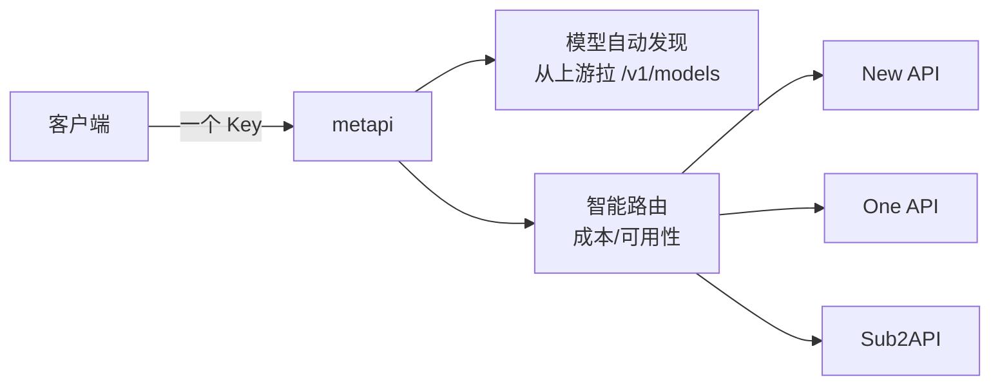

# metapi

> **聚合网关**：把你在 New API / One API / OneHub / Sub2API 等各站点注册的 key 汇聚成**一个 API Key、一个入口**，
> 自动发现模型、智能路由、成本最优。

## 项目卡片

| 项 | 值 |
|---|---|
| 仓库 | [cita-777/metapi](https://github.com/cita-777/metapi) |
| Star | ~3.2k |
| 语言 | TypeScript |
| 协议 | MIT |
| 官网 | metapi.cita777.me |

## 核心能力

- 多上游站点统一入口（一个 Key 访问所有上游）
- 自动发现模型（从各上游拉模型列表合并）
- 智能路由（按成本/可用性选择上游）
- 与 RelayHub 的关系：它是"中转站的上游是其他中转站"时的网关

## 架构

## 对 RelayHub 的启发

1. **模型自动发现**：启动/定时从上游 `/v1/models` 拉模型列表合并成路由表 —— RelayHub 的渠道配置可以加 `sync_models: true` 选项。
2. **"成本最优"路由策略**：多上游同一模型时按单价选 —— RelayHub 路由策略插件可加 `cheapest`。
3. **一个 Key 聚合**：说明"虚拟 Key → 多真实 Key"的映射是通用需求。

---

# 模块清单表

| 模块（源码路径） | 职责 | 关键文件 |
|---|---|---|
| `src/server/index.ts` | 服务入口 | `index.ts` |
| `src/server/routes/` | **API 路由**：OpenAI 兼容端点（chat/completions、responses、models） | `routes/` |
| `src/server/proxy-core/` | **代理核心**：请求编排、渠道选择、执行器 | `proxy-core/` |
| `src/server/proxy-core/channelSelection.ts` | **渠道选择**：按成本/可用性选上游 | `channelSelection.ts` |
| `src/server/proxy-core/providers/` | **上游 Provider 适配**：NewAPI/OneAPI/Sub2API 等 | `providers/` |
| `src/server/proxy-core/executors/` | 请求执行器（转发/流式） | `executors/` |
| `src/server/proxy-core/conductor/` `orchestration/` | 请求编排（多上游协调） | `conductor/` |
| `src/server/proxy-core/surfaces/` | 协议表面（chat/responses/messages 入口） | `surfaces/` |
| `src/server/services/` | 业务服务（模型发现、配置、key 管理） | `services/` |
| `src/server/transformers/` | 请求/响应转换 | `transformers/` |
| `src/server/db/` | 数据库层（drizzle ORM） | `db/` |
| `src/web/` | Web 管理前端 | `web/` |
| `src/shared/` | 前后端共享类型 | `shared/` |

## 请求数据流（文字版）

1. 客户端用一个 Key → `/v1/chat/completions`。
2. `surfaces` 解析请求协议 → `channelSelection` 按模型匹配上游（自动发现合并的模型表）。
3. `providers` 适配到具体上游（NewAPI/OneAPI/Sub2API...）→ `executors` 转发。
4. 失败/慢 → `conductor` 协调回退到其他上游。
5. `transformers` 把上游响应转回 OpenAI 格式返回。
