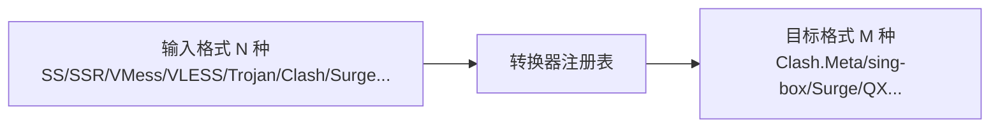

# Sub-Store

> **订阅管理/转换器**（10.3k star）：把各种格式的订阅（Clash/Surge/QX/SS/VMess 等几十种）互转、过滤、格式化。
> 虽是"机场订阅"领域，但它的**转换器注册表设计**对 RelayHub 的协议转换插件很有参考价值。

## 项目卡片

| 项 | 值 |
|---|---|
| 仓库 | [sub-store-org/Sub-Store](https://github.com/sub-store-org/Sub-Store) |
| Star | ~10.3k |
| 语言 | JavaScript |
| 协议 | AGPL-3.0 |
| 文档 | [Wiki](https://github.com/sub-store-org/Sub-Store/wiki) |

## 核心能力

- **订阅转换**：几十种输入格式（Clash/Surge/Loon/QX/Shadowrocket/sing-box/V2Ray/URI…）互转
- 订阅格式化：正则过滤、地区过滤、类型过滤、脚本操作、重命名、排序
- 多订阅聚合为一个 URL
- 托管和修改订阅/文件

## 转换器设计（对协议插件有价值）



每个"输入格式 → 目标格式"都是独立转换器，注册表按需加载 —— 和 RelayHub"渠道协议转换插件"完全同构。

## 对 RelayHub 的启发

1. **转换器注册表**：`format: 输入 → 输出` 的插件化注册模式，可直接用于 RelayHub 的协议转换插件（OpenAI→Claude 等）。
2. **格式化管道**：过滤/重命名/排序做成可组合的操作链 —— RelayHub 的"请求前处理插件"也可做成管道。
3. **配置即声明**：Sub-Store 的订阅操作全在配置/脚本里声明，无数据库 —— 与 RelayHub 哲学一致。

---

# 模块清单表

| 模块（源码路径） | 职责 | 关键文件 |
|---|---|---|
| `backend/src/main.js` | 后端入口 | `main.js` |
| `backend/src/core/app.js` | **核心应用**：订阅处理编排、格式转换分发 | `core/app.js` |
| `backend/src/core/proxy-utils/` | 代理节点解析/生成（各协议 URI 解析） | `core/proxy-utils/` |
| `backend/src/core/rule-utils/` | 过滤规则（正则/地区/类型/脚本） | `core/rule-utils/` |
| `backend/src/restful/` | **REST API**：订阅管理、转换、同步端点 | `restful/` |
| `backend/src/products/` | 各平台产品适配（Surge/Loon/QX/Clash...） | `products/` |
| `backend/src/utils/` | 工具 | `utils/` |
| `config/` | 配置 | `config/` |

## 转换器注册表机制（核心设计）

```
输入格式(N 种)                   目标格式(M 种)
SS / SSR / VMess / VLESS     →   Clash / Clash.Meta / sing-box
Trojan / Hysteria / WireGuard →   Surge / Loon / QX / Shadowrocket
Clash YAML / Surge conf 等        V2Ray / URI ...
        │                              ▲
        └────── 转换器注册表（每对格式一个转换器）──────┘
```

每个"输入→输出"对是一个独立转换器，注册表按需加载、可独立扩展。

## 数据处理流（文字版）

1. REST API 接收订阅 URL/内容。
2. `proxy-utils` 解析输入格式 → 统一节点对象。
3. `rule-utils` 按配置执行过滤/重命名/排序/脚本操作（可组合的操作链）。
4. `products` 按目标格式渲染输出（Clash/Surge/QX...）。
5. 支持多订阅聚合为一个 URL、定时同步、托管修改。
