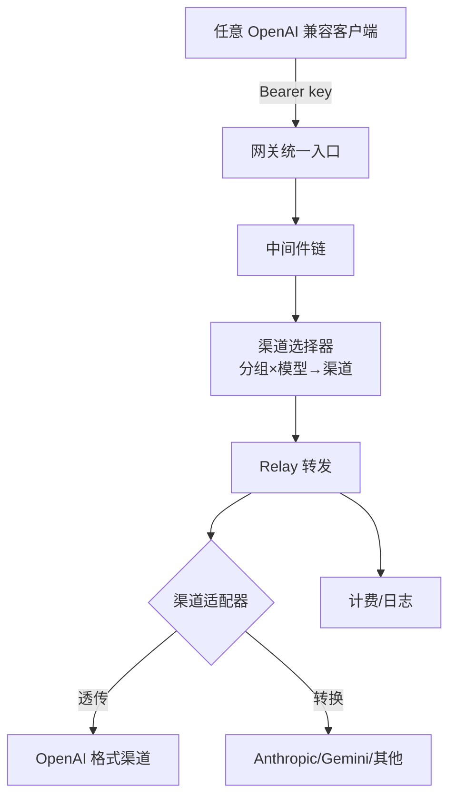

# AI 中转站开源项目调研资料库

> 给 **RelayHub**（自用 AI 网关：微内核 + 插件化 + config.yaml 一把梭）准备的参考资料库。
> 收录所有 star > 1k 的开源 AI 中转站，按"架构路线"分类，每个项目独立一篇，带完整超链接和架构图。

## 阅读建议

- **先看** [02 · 轻量网关](./02-lightweight-gateway/README.md) —— 和 RelayHub 定位最像
- **必读** [simple-one-api](./02-lightweight-gateway/simple-one-api.md) 和 [LiteLLM](./02-lightweight-gateway/litellm.md) —— 架构参照物
- **后续写"网页转 API 插件"时**翻 [04 · 网页/订阅转 API](./04-web2api/README.md)
- **要理解渠道/计费/重试**看 [01 · One API 系](./01-one-api-family/README.md)

## 总览对比表

| 分类 | 项目 | Star | 语言 | 定位 | 有无DB | 有无UI | 计费 |
|---|---|---|---|---|---|---|---|
| [01 · One API 系](./01-one-api-family/README.md) | [one-api](./01-one-api-family/one-api.md) | 36.5k | Go+React | 分发管理鼻祖 | ✅ | ✅ | ✅ |
| | [new-api](./01-one-api-family/new-api.md) | 45.7k | Go+React | one-api 现代二开 | ✅ | ✅ | ✅ |
| | [coai](./01-one-api-family/coai.md) | 9.3k | Go+React | NextWeb+OneAPI 合体 | ✅ | ✅ | ✅ |
| [02 · 轻量网关](./02-lightweight-gateway/README.md) | [simple-one-api](./02-lightweight-gateway/simple-one-api.md) ⭐ | 2.3k | Go | **单文件+config，无DB** | 可选SQLite | 内嵌 | ❌ |
| | [LiteLLM](./02-lightweight-gateway/litellm.md) ⭐ | 56.8k | Python | SDK+Proxy 双层 | ✅ | ✅ | ✅ |
| | [Portkey Gateway](./02-lightweight-gateway/portkey-gateway.md) | 12.8k | TS | 极轻量 122kb | ❌ | Console | ✅ |
| | [openai-forward](./02-lightweight-gateway/openai-forward.md) | ~1k | Python | 纯转发+缓存（已归档） | ❌ | WebUI | ❌ |
| [03 · 云原生](./03-cloud-native-gateway/README.md) | [Higress](./03-cloud-native-gateway/higress.md) | 9.2k | Go | Envoy+Wasm 插件 | ❌ | ✅ | 插件 |
| | [Envoy AI Gateway](./03-cloud-native-gateway/envoy-ai-gateway.md) | 1.9k | Go | Envoy 标准 AI 网关 | ❌ | ❌ | ❌ |
| [04 · 网页/订阅转API](./04-web2api/README.md) | [sub2api](./04-web2api/sub2api.md) ⭐ | 37.8k | Go | 订阅账号→OpenAI API | ✅ | ✅ | ✅ |
| | [gpt4free](./04-web2api/gpt4free.md) | 66.6k | Python | 网页端聚合转 API | ❌ | GUI | ❌ |
| | [chatgpt2api](./04-web2api/chatgpt2api.md) | 5.9k | Python | ChatGPT 官网协议逆向 | ❌ | ❌ | 号池 |
| | [openai-cpa](./04-web2api/openai-cpa.md) | 1.4k | - | CPA/Sub2API 控制面 | ❌ | ✅ | ❌ |
| | [AutoTeam](./04-web2api/autoteam.md) | 1.2k | Python | Team 号池轮转 | ❌ | ❌ | ❌ |
| | [pandora-next](./04-web2api/pandora-next.md) | 已下架 | Go | 逆向鼻祖（存档） | - | - | - |
| [05 · 生态工具](./05-ecosystem/README.md) | [metapi](./05-ecosystem/metapi.md) | 3.2k | TS | 多中转站聚合入口 | ❌ | ✅ | ❌ |
| | [all-api-hub](./05-ecosystem/all-api-hub.md) | 4.7k | TS | 账号管理看板 | ✅ | ✅ | ❌ |
| | [Sub-Store](./05-ecosystem/sub-store.md) | 10.3k | JS | 订阅转换器 | ❌ | ✅ | ❌ |
| [06 · 商业参考](./06-commercial-reference/README.md) | [OpenRouter](./06-commercial-reference/openrouter/openrouter.md) | - | - | 闭源 AI 聚合路由 | - | - | - |

## 架构共性总结（写 RelayHub 时直接套用）

### 1. 统一入口 + 适配器模式

所有中转站的骨架都一样：对外一个 OpenAI 兼容入口，对内每个渠道一个适配器。



**适配器接口（one-api 的定义，全行业通用）**：
`Init / GetRequestURL / SetupRequestHeader / ConvertRequest / DoRequest / DoResponse / GetModelList / GetChannelName`

### 2. 请求生命周期

1. 认证：Bearer token → 用户/分组/额度
2. 限流：全局 / 用户 / 模型三级
3. 渠道选择：按 分组+模型 从索引随机/权重/轮询选渠道
4. 转发：透传 或 转换格式（OpenAI⇄Claude⇄Gemini）
5. 计费：`模型倍率 × 分组倍率 × tokens`（流式回填 usage）
6. 失败重试：5xx/429 换渠道，4xx 直接返回

### 3. 性能关键点

- **内存渠道索引**（`group2model2channels`）：启动时建好，运行时 O(1) 选渠道 —— 不查库
- **流式转发**：SSE 逐块透传，不整块缓冲
- **批量回写**：计费/日志先入内存队列，后台批量写库（RelayHub 无库，写文件/插件即可）

## 学习路线

```
第 1 步  读 simple-one-api（配置结构 + 路由策略）          ← 定位最像
第 2 步  读 one-api 的 adaptor/interface.go + distributor   ← 渠道/重试
第 3 步  读 LiteLLM 的 ARCHITECTURE.md（翻译层 + 计费）    ← 插件化范本
第 4 步  读 new-api 的 relaykit（协议转换）                 ← 多格式支持
第 5 步  需要时翻 04-web2api（网页转 API 插件弹药库）
```

## 数据说明

- Star 数据为 2026-08 调研时点，GitHub 上可能已变化
- sub2api 生态（2025-12 才出现）迭代极快，仓库可能改名/换主，以 GitHub 搜索为准
- 逆向类项目（04 类）违反上游 ToS，**仅供学习研究，RelayHub 不内置此类能力**
